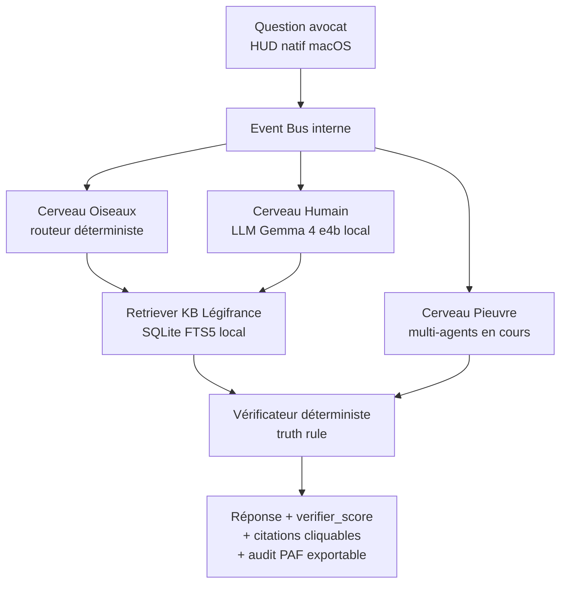

<p align="center">
  
</p>

<p align="center"><sub><a href="README.md">Read in English</a></sub></p>

<p align="center">
  <a href="LICENSE"></a>
  
  
  
  <a href="https://python.org"></a>
  
  <a href="bench/results/2026-05-12_battery_16q_post_p2a.md"></a>
</p>

---

## Mission

Beaume est un assistant juridique 100 % local pour avocats français.
Tout reste sur le Mac de l'avocat — pas de cloud, pas de logs sortants,
pas de fuite. Architecture en trois cerveaux complémentaires
(déterministe rapide + LLM créatif + multi-agents distribués) sur une
seule machine, conçue pour la qualité montre suisse en droit social.

---

## Sommaire

- [Aperçu](#aperçu)
- [Statut transparent](#statut-transparent)
- [Pourquoi 100 % local](#pourquoi-100--local)
- [Comment ça marche](#comment-ça-marche)
- [Métriques vérifiables](#métriques-vérifiables)
- [Installation](#installation)
- [Roadmap publique](#roadmap-publique)
- [Statut du projet](#statut-du-projet)
- [License & Open Source Status](#license--open-source-status)
- [Liens](#liens)

---

## Aperçu

<p align="center">
  
</p>

*Le HUD natif Beaume répond à une question de licenciement
économique avec citations Légifrance cliquables.*

<p align="center">
  
</p>

*Chaque citation est vérifiée déterministiquement contre la base
locale Légifrance avant d'apparaître à l'utilisateur — truth rule.*

<p align="center">
  
</p>

*Le badge `verifier_score` indique le taux de citations validées.
Vert ≥ 90 %, ambre 70-89 %, rouge < 70 %.*

---

## Statut transparent

| Champ | Valeur |
|-------|--------|
| Version actuelle | `v1.0` alpha (commit [`f393f53`](https://github.com/mathieuballotma-sketch/lucie/commit/f393f53) et au-delà) |
| Fiabilité batterie 16q multi-angles | **62,5 %** ([preuve](bench/results/2026-05-12_battery_16q_post_p2a.md)) |
| Fiabilité batterie 50q cœur lic éco | **en recalibrage** ([statut](bench/results/2026-05-12_battery_50q_post_p2a.md)) |
| Architecture trois cerveaux | Oiseaux ✓ · Humain ✓ · Pieuvre en cours (Sprint 9-10) |
| Prochain milestone | Sprint 7 — lecture dossier client PDF/docx |
| Financement | Bootstrap solo, fonds propres, zéro VC |
| Candidature | Y Combinator Summer 2026 |
| Auteur | Mathieu Bellot, 18 ans |

**Beaume n'est pas production-ready.** Le pilote avocat
(semaine 12-18 mai 2026) sert exactement à mesurer cet écart en
conditions réelles.

---

## Pourquoi 100 % local

Un avocat ne peut pas faire transiter un dossier client par un LLM
cloud sans entrer en conflit avec :

- **Le secret professionnel** (art. 226-13 du Code pénal, art. 66-5
  de la loi de 1971)
- **Le RGPD** — minimisation, finalité, transferts hors UE pour les
  modèles US
- **L'audit interne** des cabinets et des compagnies d'assurance
  professionnelle
- **Le fonctionnement offline** (audience, train, déplacement client)

Beaume tourne entièrement sur le Mac de l'avocat. Aucun appel sortant
en runtime hors `127.0.0.1:11434` (Ollama local). Aucune télémétrie.
La KB Légifrance est générée localement à partir des archives DILA
publiques.

Détail des surfaces d'attaque et mitigations :
[`docs/THREAT_MODEL.md`](docs/THREAT_MODEL.md).

---

## Comment ça marche



Les composants sont cliquables vers le code dans
[`docs/architecture.md`](docs/architecture.md) — chaque box du
diagramme pointe vers son implémentation Python.

Trois cerveaux complémentaires :

- **Cerveau Oiseaux** — routeur déterministe, latence < 50 ms, zéro
  appel LLM. Rejette en amont les questions hors périmètre et les
  références d'article invalides.
- **Cerveau Humain** — LLM local Gemma 4 e4b qui formule la réponse à
  partir de matériel déjà validé.
- **Cerveau Pieuvre** — orchestration multi-agents pour requêtes
  composites (en cours, livraison Sprint 9-10).

Le **Vérificateur** rejette toute citation qui n'est pas dans
l'index Légifrance local. C'est la truth rule architecturale :
on préfère refuser que halluciner.

---

## Métriques vérifiables

Toutes les métriques affichées dans ce README sont reproductibles.

- **Mapping claim → preuve → commande** :
  [`docs/EVIDENCE.md`](docs/EVIDENCE.md)
- **Recette de reproduction depuis un clone neuf** :
  [`docs/REPRODUCE.md`](docs/REPRODUCE.md)
- **Résultats batterie historiques** :
  [`bench/results/`](bench/results/)
- **Historique des sprints (résumé public)** :
  [`docs/sprints/SUMMARY.md`](docs/sprints/SUMMARY.md)
- **Issues connues** : [`KNOWN_ISSUES.md`](KNOWN_ISSUES.md)

Discipline : si une affirmation de ce README n'a pas de ligne dans
`docs/EVIDENCE.md`, elle est retirée. Pas d'affirmation sans preuve.

---

## Installation

**Prérequis** : macOS Apple Silicon (M1 / M2 / M3 / M4), Python 3.11+,
[Ollama](https://ollama.com).

```bash
brew install ollama
ollama pull gemma2:9b
git clone https://github.com/mathieuballotma-sketch/lucie.git beaume
cd beaume
python3 -m venv venv && source venv/bin/activate
pip install -r requirements.txt
PYTHONPATH=. python3 main_hud.py
```

Recette complète de reproduction (KB Légifrance, batteries, tests) :
[`docs/REPRODUCE.md`](docs/REPRODUCE.md).

Un build `.dmg` signé Developer ID est en cours de préparation.

> Note historique : l'URL du dépôt est `mathieuballotma-sketch/lucie`
> (le produit s'appelait Lucie avant le pivot droit social du 2 mai
> 2026). Le rebrand côté code est complet ; seul le slug GitHub reste,
> pour préserver l'historique des commits.

---

## Roadmap publique

| Étape | Contenu | Cible |
|-------|---------|-------|
| Sprint 6 P2a | Retriever débridé + Vérificateur normalisé | livré 2026-05-12 |
| Sprint 7 | Lecture dossier client PDF/docx | 2026-05 |
| Sprint 8 | Cerveau Déterministe — logique math des lois (calcul indemnités, délais, plafonds) | 2026-06 |
| Sprint 9-10 | Architecture trois cerveaux complète (Cerveau Pieuvre opérationnel) | 2026-07 |
| Alpha élargie | Test alpha avocats français | Q3 2026 |
| Multi-pays | Sélection langue / droit au premier lancement, KB Belgique + Suisse | Q1 2027 |

D'autres modules sont en réserve interne et ne sont pas listés ici —
c'est volontaire.

---

## Statut du projet

- **Solo bootstrap**, fonds propres (zéro VC, zéro pré-vente)
- Mathieu Bellot, 18 ans, candidature **Y Combinator Summer 2026**
- Mac M4 24 Go, budget cumulé ≈ €500 sur 5 mois
- Pas de team, pas de communication payante, pas de blog post
  auto-promotionnel

Pour les avocats partenaires intéressés par le pilote, mentors,
investisseurs : [mathieu.ballotma@gmail.com](mailto:mathieu.ballotma@gmail.com).

---

## License & Open Source Status

Beaume est **source-available** sous
[Business Source License 1.1](LICENSE) — la même licence que
MariaDB, Sentry et CockroachDB.

L'architecture, les tests et le pipeline cœur sont publics. Certains
composants restent propriétaires : prompts de domaine tunés finement,
règles déterministes spécifiques, et données diagnostic de batterie
détaillées. Licence commerciale disponible pour usage production.

**Change date** : 2030-04-17 → bascule automatique en Apache 2.0
sans intervention requise.

Doctrine de séparation public / réserve compétitive :
[`docs/THREAT_MODEL.md`](docs/THREAT_MODEL.md) et
[`docs/sprints/SUMMARY.md`](docs/sprints/SUMMARY.md).

---

## Liens

- [`PRINCIPLES.md`](PRINCIPLES.md) — six principes Beaume
- [`docs/architecture.md`](docs/architecture.md) — architecture
  détaillée avec liens code
- [`docs/EVIDENCE.md`](docs/EVIDENCE.md) — table claim → preuve
- [`docs/REPRODUCE.md`](docs/REPRODUCE.md) — recette reproduction
- [`docs/THREAT_MODEL.md`](docs/THREAT_MODEL.md) — modèle de menace
- [`CHANGELOG.md`](CHANGELOG.md) — historique des versions
- [`KNOWN_ISSUES.md`](KNOWN_ISSUES.md) — bugs connus
- [`CONTRIBUTING.md`](CONTRIBUTING.md) — comment contribuer
  (volontairement limité)
- [`SECURITY.md`](SECURITY.md) — signaler une vulnérabilité

Site : [lucie-site.vercel.app](https://lucie-site.vercel.app)
(sera renommé après pilote).

---

<sub>Mathieu Bellot · solo bootstrap · mai 2026 · BSL 1.1</sub>
