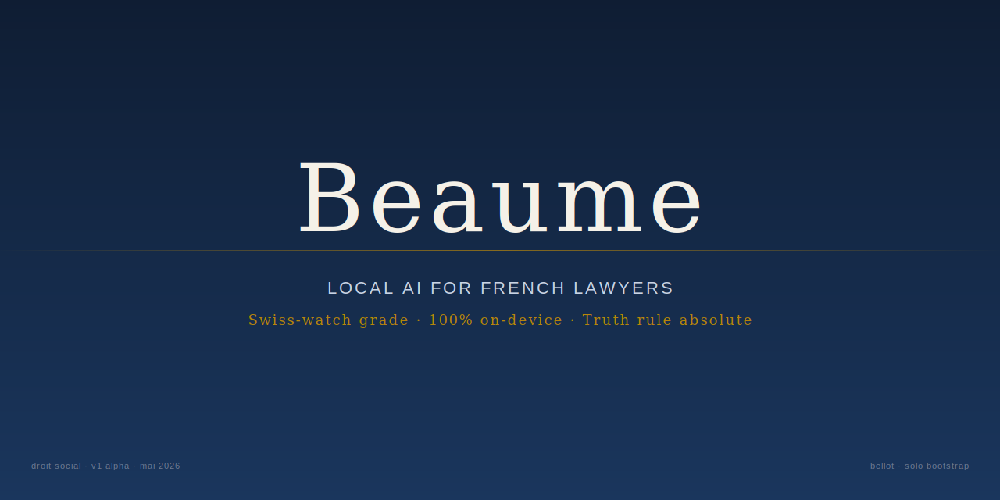
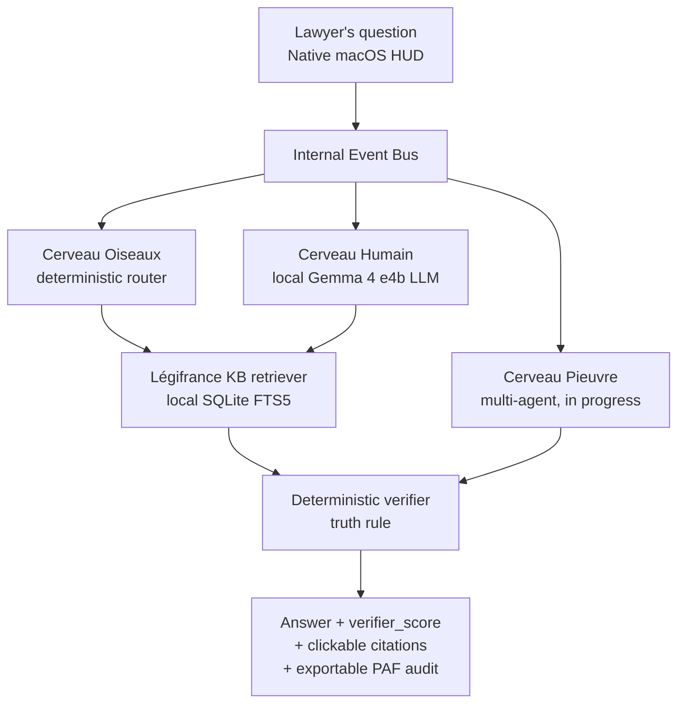

<p align="center">
  
</p>

<p align="center"><sub><a href="README.fr.md">Lire en français</a></sub></p>

<p align="center">
  <a href="LICENSE"></a>
  
  
  
  <a href="https://python.org"></a>
  
  <a href="bench/results/2026-05-12_battery_16q_post_p2a.md"></a>
</p>

---

## Mission

Beaume is a 100% on-device legal assistant for French lawyers
practicing employment law. Everything stays on the lawyer's Mac — no
cloud, no outbound logs, no leakage. A three-brain architecture
(fast deterministic + creative LLM + distributed multi-agent) on a
single machine, designed for Swiss-watch quality in French
employment law.

---

## Table of contents

- [Overview](#overview)
- [Transparent status](#transparent-status)
- [Why 100% on-device](#why-100-on-device)
- [How it works](#how-it-works)
- [Verifiable metrics](#verifiable-metrics)
- [Installation](#installation)
- [Public roadmap](#public-roadmap)
- [Project status](#project-status)
- [License & Open Source Status](#license--open-source-status)
- [Links](#links)

---

## Overview

<p align="center">
  
</p>

*The native Beaume HUD answers a question about economic dismissal
(licenciement économique — France) with clickable Légifrance
citations.*

<p align="center">
  
</p>

*Every citation is deterministically verified against the local
Légifrance index before reaching the user — the truth rule.*

<p align="center">
  
</p>

*The `verifier_score` badge reports the share of validated citations.
Green ≥ 90%, amber 70-89%, red < 70%.*

---

## Transparent status

| Field | Value |
|-------|-------|
| Current version | `v1.0` alpha (commit [`f393f53`](https://github.com/mathieuballotma-sketch/lucie/commit/f393f53) and beyond) |
| Reliability — 16q multi-angle battery | **62.5%** ([evidence](bench/results/2026-05-12_battery_16q_post_p2a.md)) |
| Reliability — 50q economic-dismissal core battery | **recalibrating** ([status](bench/results/2026-05-12_battery_50q_post_p2a.md)) |
| Three-brain architecture | Oiseaux ✓ · Humain ✓ · Pieuvre in progress (Sprint 9-10) |
| Next milestone | Sprint 7 — client-file ingestion (PDF/docx) |
| Funding | Solo bootstrap, self-funded, zero VC |
| Application | Y Combinator Summer 2026 |
| Author | Mathieu Bellot, 18 |

**Beaume is not production-ready.** The lawyer pilot (week of
May 12-18, 2026) exists precisely to measure that gap under real
conditions.

---

## Why 100% on-device

A lawyer cannot route a client file through a cloud LLM without
conflicting with:

- **Attorney-client privilege** (French *secret professionnel* —
  art. 226-13 of the Code pénal, art. 66-5 of the 1971 statute)
- **GDPR** — minimization, purpose limitation, non-EU transfers for
  US-hosted models
- **Internal audit** of law firms and professional liability insurers
- **Offline operation** (court hearings, trains, client visits)

Beaume runs entirely on the lawyer's Mac. No outbound calls at
runtime apart from `127.0.0.1:11434` (local Ollama). No telemetry.
The Légifrance KB is generated locally from public DILA archives.

Attack surfaces and mitigations are detailed in
[`docs/THREAT_MODEL.md`](docs/THREAT_MODEL.md).

---

## How it works



Each box in the diagram is clickable to its Python implementation
from [`docs/architecture.md`](docs/architecture.md).

Three complementary brains:

- **Cerveau Oiseaux** (Birds Brain) — deterministic router, < 50 ms
  latency, zero LLM calls. Rejects out-of-scope questions and
  invalid article references at the entry point.
- **Cerveau Humain** (Human Brain) — local Gemma 4 e4b LLM that
  formulates the answer from already-validated material.
- **Cerveau Pieuvre** (Octopus Brain) — multi-agent orchestration
  for compound queries (in progress, shipping Sprint 9-10).

The **Verifier** rejects any citation absent from the local
Légifrance index. This is the architectural truth rule: refuse
rather than hallucinate.

---

## Verifiable metrics

Every metric shown in this README is reproducible.

- **Claim → evidence → command mapping**:
  [`docs/EVIDENCE.md`](docs/EVIDENCE.md)
- **Reproduction recipe from a fresh clone**:
  [`docs/REPRODUCE.md`](docs/REPRODUCE.md)
- **Historical battery results**:
  [`bench/results/`](bench/results/)
- **Sprint history (public summary)**:
  [`docs/sprints/SUMMARY.md`](docs/sprints/SUMMARY.md)
- **Known issues**: [`KNOWN_ISSUES.md`](KNOWN_ISSUES.md)

Discipline: any claim in this README without a corresponding line in
`docs/EVIDENCE.md` is removed. No claim without evidence.

---

## Installation

**Prerequisites**: macOS Apple Silicon — M2 with 16 GB or more, all
M3, all M4, all M5. Python 3.11+, [Ollama](https://ollama.com).

```bash
brew install ollama
ollama pull gemma4:e4b
git clone https://github.com/mathieuballotma-sketch/lucie.git beaume
cd beaume
python3.11 -m venv venv && source venv/bin/activate
pip install -r requirements.txt --no-deps  # see REPRODUCE.md for why --no-deps
PYTHONPATH=. python3 main_hud.py
```

Full reproduction recipe (Légifrance KB, batteries, tests):
[`docs/REPRODUCE.md`](docs/REPRODUCE.md).

A Developer ID-signed `.dmg` build is in preparation.

> Historical note: the repository slug is
> `mathieuballotma-sketch/lucie` (the product was called Lucie before
> the employment-law pivot on May 2, 2026). The code-side rebrand is
> complete; only the GitHub slug remains, to preserve commit history.

---

## Public roadmap

| Stage | Content | Target |
|-------|---------|--------|
| Sprint 6 P2a | Retriever unbounded + Verifier normalized | shipped 2026-05-12 |
| Sprint 7 | Client-file ingestion (PDF/docx) | 2026-05 |
| Sprint 8 | Cerveau Déterministe — mathematical logic of statutes (severance computation, deadlines, ceilings) | 2026-06 |
| Sprint 9-10 | Full three-brain architecture (Cerveau Pieuvre operational) | 2026-07 |
| Extended alpha | Alpha test with French lawyers | Q3 2026 |
| Multi-country | Language / jurisdiction selection on first launch, KB Belgium + Switzerland | Q1 2027 |

Other modules are held in internal reserve and not listed here —
this is deliberate.

---

## Project status

- **Solo bootstrap**, self-funded (zero VC, zero pre-sales)
- Mathieu Bellot, 18, applying to **Y Combinator Summer 2026**
- Mac M4 24 GB, cumulative budget ≈ €500 over 5 months
- No team, no paid marketing, no self-promotional blog posts

For partner lawyers interested in the pilot or serious collaborators:
[mathieu.ballotma@gmail.com](mailto:mathieu.ballotma@gmail.com).

---

## License & Open Source Status

Beaume is **source-available** under
[Business Source License 1.1](LICENSE) — the same license used by
MariaDB, Sentry and CockroachDB.

The architecture, tests and core pipeline are public. Some
components remain proprietary: finely tuned domain prompts,
specific deterministic rules, and detailed battery diagnostic data.
Commercial licenses are available for production use.

**Change date**: 2030-04-17 → automatic conversion to Apache 2.0,
no action required.

Public / competitive-reserve separation doctrine:
[`docs/THREAT_MODEL.md`](docs/THREAT_MODEL.md) and
[`docs/sprints/SUMMARY.md`](docs/sprints/SUMMARY.md).

---

## Links

- [`PRINCIPLES.md`](PRINCIPLES.md) — the six Beaume principles
- [`docs/architecture.md`](docs/architecture.md) — detailed
  architecture with code links
- [`docs/EVIDENCE.md`](docs/EVIDENCE.md) — claim → evidence table
- [`docs/REPRODUCE.md`](docs/REPRODUCE.md) — reproduction recipe
- [`docs/THREAT_MODEL.md`](docs/THREAT_MODEL.md) — threat model
- [`CHANGELOG.md`](CHANGELOG.md) — version history
- [`KNOWN_ISSUES.md`](KNOWN_ISSUES.md) — known bugs
- [`CONTRIBUTING.md`](CONTRIBUTING.md) — how to contribute
  (deliberately limited)
- [`SECURITY.md`](SECURITY.md) — report a vulnerability

Website: [lucie-site.vercel.app](https://lucie-site.vercel.app)
(to be renamed after pilot).

---

<sub>Mathieu Bellot · solo bootstrap · May 2026 · BSL 1.1</sub>
