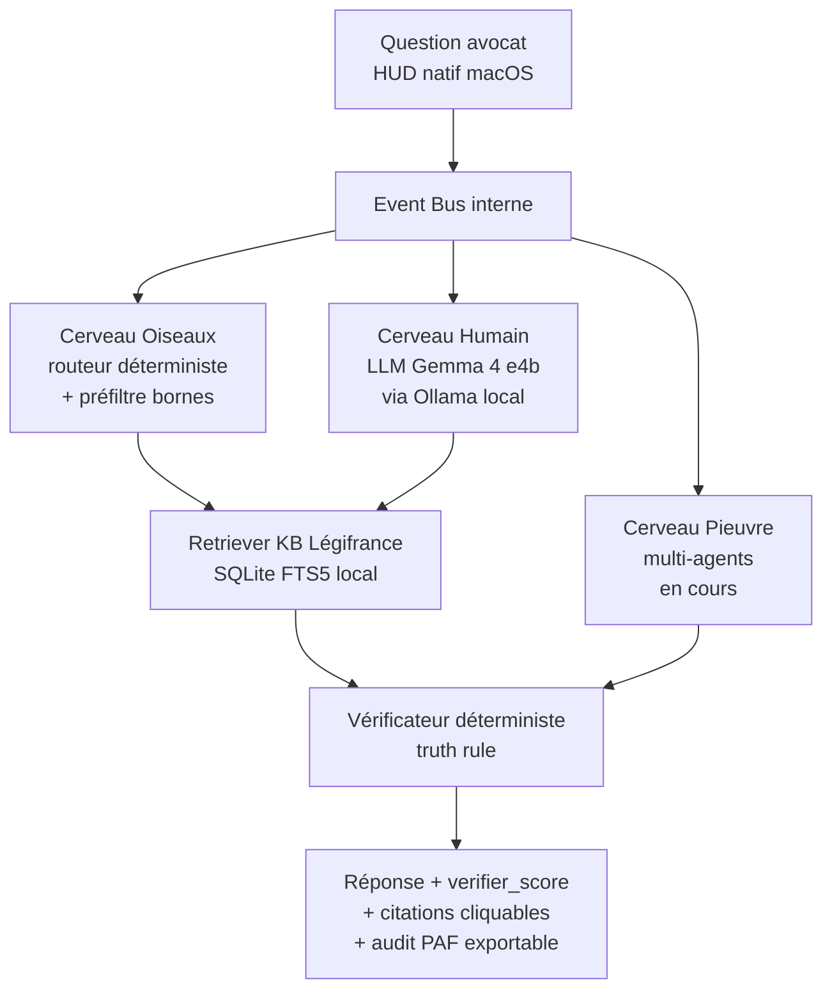

# Architecture Beaume

*[Read in English](architecture.md)*

Document public. High-level. Pas de détails internes sensibles
(prompts tunés, seuils empiriques, causes racines de bugs — voir
[`docs/sprints/SUMMARY.fr.md`](sprints/SUMMARY.fr.md) pour la doctrine).

---

## Vue d'ensemble

Beaume répond à une question d'avocat en passant par trois cerveaux
complémentaires + un vérificateur déterministe en aval.



Composants cliquables :

- **HUD natif macOS** → [`app/ui/hud_native.py`](../app/ui/hud_native.py)
- **Event Bus** → [`lucie_v1_standalone/pipeline.py`](../lucie_v1_standalone/pipeline.py)
- **Cerveau Oiseaux (routeur)** → [`lucie_v1_standalone/dialogue/intent_classifier.py`](../lucie_v1_standalone/dialogue/intent_classifier.py)
- **Cerveau Humain (LLM local)** → [`lucie_v1_standalone/ollama_client.py`](../lucie_v1_standalone/ollama_client.py)
- **Retriever KB Légifrance** → [`lucie_v1_standalone/retriever.py`](../lucie_v1_standalone/retriever.py) + [`lucie_v1_standalone/knowledge_legifrance/retriever.py`](../lucie_v1_standalone/knowledge_legifrance/retriever.py)
- **Vérificateur** → [`lucie_v1_standalone/verificateur.py`](../lucie_v1_standalone/verificateur.py)
- **Mémoire adaptative** → [`lucie_v1_standalone/memory/`](../lucie_v1_standalone/memory/)

---

## Les trois cerveaux

### Cerveau Oiseaux — déterministe rapide

Routeur d'intention + préfiltre numérique. Latence cible : < 50 ms,
zéro appel LLM. Rejette en amont les questions hors périmètre, les
références d'article invalides (bornes numériques) et les
ambiguïtés `lic_eco` vs `lic_perso`.

Pourquoi déterministe d'abord : c'est la garantie architecturale
que la truth rule (principe 2 de [`PRINCIPLES.fr.md`](../PRINCIPLES.fr.md))
est appliquée *avant* qu'un LLM n'ait eu l'occasion d'halluciner.

### Cerveau Humain — LLM local

Formule la réponse en langage naturel à partir de matériel déjà
validé (chunks Légifrance retournés par le retriever).

Modèle : Gemma 4 e4b via Ollama, `keep_alive=24h` pour éviter le
reload entre appels. Le modèle est interchangeable (Llama, Mistral,
Qwen) au prix d'une recalibration des seuils Vérificateur — pas
breaking architecturalement.

### Cerveau Pieuvre — multi-agents (en cours)

Orchestre les requêtes composites qui nécessitent de combiner
plusieurs sources (jurisprudence + Code + dossier client). Livraison
Sprint 9-10 (été 2026).

Tant que Pieuvre n'est pas livré, le pipeline reste sur 2 cerveaux
opérationnels (Oiseaux + Humain). Honnêteté : on ne dit pas « 3
cerveaux fonctionnels » avant qu'ils ne le soient.

---

## Vérificateur déterministe en aval

Trois points d'application de la truth rule :

1. **Refus déterministe avant LLM** — si la question est hors
   périmètre ou si la référence d'article cité dans la question est
   invalide, refus immédiat (Cerveau Oiseaux).
2. **Vérification des citations post-génération** — chaque citation
   produite par le Cerveau Humain est canonicalisée et matchée
   contre l'index Légifrance local. Les citations dupliquées sont
   dédoublonnées (Sprint 6 P2a). Le score `verifier_score` est
   calculé sur les citations uniques, pas sur les occurrences
   brutes.
3. **Audit trail exposé à l'utilisateur** — chaque réponse expose
   `verifier_score` (vert/ambre/rouge), les citations validées, le
   tooltip avec verdict détaillé. Bouton « Exporter audit PAF »
   dans le menubar.

Justification du seuil `verifier_score ≥ 0.70` : voir
[`bench/CHANGELOG.fr.md`](../bench/CHANGELOG.fr.md).

---

## Knowledge base Légifrance

Index local SQLite avec FTS5, généré à partir des archives DILA
publiques (`legifrance` du site officiel).

- Taille typique : ~4,6 Go compactés
- **Non inclus dans le repo public** : trop volumineux, ignoré
  explicitement par [`.gitignore`](../.gitignore)
  (`knowledge/legifrance/data/`, `tarballs/`).
- Génération : voir [`lucie_v1_standalone/knowledge_legifrance/`](../lucie_v1_standalone/knowledge_legifrance/) (parser DILA + indexer)

Conséquence pratique : un utilisateur qui clone le repo public doit
générer son propre index localement avant que Beaume soit
opérationnelle. C'est intentionnel — la KB Légifrance n'est pas un
secret, mais elle est dérivable publiquement par chacun.

---

## Mémoire adaptative

Stockage local par utilisateur dans
`~/Library/Application Support/Beaume/`. La page « Ce que Beaume
sait de vous » du HUD expose toute la mémoire et permet un reset
complet en un clic.

Composants :

- [`lucie_v1_standalone/memory/personal.py`](../lucie_v1_standalone/memory/personal.py) — préférences explicites
- [`lucie_v1_standalone/memory/abstract.py`](../lucie_v1_standalone/memory/abstract.py) — patterns d'usage
- [`lucie_v1_standalone/memory/store.py`](../lucie_v1_standalone/memory/store.py) — persistance JSON locale
- [`lucie_v1_standalone/memory/sanitizer.py`](../lucie_v1_standalone/memory/sanitizer.py) — détection PII avant écriture

Conséquence du principe 5 ([`PRINCIPLES.fr.md`](../PRINCIPLES.fr.md)) :
deux instances Beaume sur deux Mac différents divergent après quelques
semaines d'usage. Aucune mémoire partagée cloud.

---

## Spécification formelle de l'architecture

> *Cette spécification décrit l'**architecture cible** Beaume au
> 12 mai 2026. Certains composants — notamment le backward chaining
> et le constraint solver du moteur d'inférence — sont partiellement
> implémentés en v1 et seront livrés au Sprint 8 (Cerveau
> Déterministe). Voir [`docs/sprints/SUMMARY.fr.md`](sprints/SUMMARY.fr.md)
> pour l'état d'avancement.*

### Définition scientifique

> Beaume est un **expert system** (système expert) juridique
> déterministe à pipeline d'inférence structuré, utilisant un LLM
> uniquement comme couche de surface linguistique, sans
> participation au processus décisionnel.

### Pipeline — 7 étages

```
INPUT UTILISATEUR
       ↓
ORCHESTRATEUR (Pieuvre)        — gestion flux + mémoire + planification
       ↓
MOTEUR D'INFÉRENCE (Oiseaux)   — règles juridiques + chaining + contraintes
       ↓
MOTEUR DE DONNÉES              — articles loi + jurisprudence + base locale
       ↓
VALIDATION DÉTERMINISTE        — existence article + cohérence règles
       ↓
LLM (Cerveau Humain)           — rédaction uniquement, pas de décision
       ↓
RÉPONSE UTILISATEUR
```

### Décomposition des modules (signature-only)

**Orchestrateur (Pieuvre)** — gestion de flux, sans logique
juridique :

```python
class Orchestrator:
    def process(self, query: str) -> dict:
        state = self.load_memory(query)
        plan = self.plan(query, state)
        result = self.execute_plan(plan)
        self.save_memory(query, result)
        return result
```

**Moteur d'inférence (Oiseaux)** — trois opérations :

- `forward(facts)` — forward chaining : faits → règles activées → nouveaux faits → boucle
- `backward(goal)` — backward chaining : objectif → règles → sous-objectifs → faits
- `solve(constraints)` — constraint solving : contraintes juridiques → ensemble cohérent

**Base juridique (Knowledge Layer)** — format minimal v1 :

```json
{
  "L.1234-9": {
    "conditions": ["ancienneté >= 8 mois"],
    "result": "indemnité obligatoire"
  }
}
```

**Module retrieval** — `find_article(query) -> article | None`.

**Validation déterministe** — `validate(article) -> bool` :
l'article existe, l'ensemble de règles est cohérent, sinon STOP ou
fallback.

**LLM (Cerveau Humain)** — rôle UNIQUE : transformer structure →
langage avocat. Aucune décision, aucune référence inventée.

### Modèle de mémoire (par requête)

```json
{
  "query": "...",
  "facts": [],
  "applied_rules": [],
  "decisions": [],
  "questions_missing": []
}
```

### Propriétés formelles

1. **Déterminisme global** — `output(X) = constant` (sous conditions,
   voir raffinement 1).
2. **Séparation stricte des rôles** — orchestrateur = flux, moteur
   d'inférence = logique, KB = vérité, LLM = langage.
3. **Traçabilité complète** — question → règles → faits → décision → texte.
4. **Absence d'hallucination juridique** — le LLM ne peut pas
   introduire de nouveaux articles.
5. **Sans dépendance cloud** — 100% local.

### Ce que Beaume EST

> Un **système expert juridique déterministe augmenté d'un module
> de génération linguistique**.

### Ce que Beaume N'EST PAS

- Pas un agent LLM autonome
- Pas un système probabiliste
- Pas un modèle génératif décisionnel
- Pas un système stochastique de raisonnement

### Raffinements (validés 2026-05-12)

1. **Le déterminisme global est conditionné par la config LLM.**
   `output(X) = constant` n'est garanti que si `temperature=0` ET
   `seed` fixe ET prompt strictement identique. Sinon, deux
   exécutions LLM peuvent produire deux formulations différentes
   (mêmes faits, syntaxe variable). À pinner explicitement dans la
   config Ollama.
2. **Le LLM peut encore halluciner sur la formulation** — pas sur
   le contenu juridique (verrouillé), mais sur des nuances de ton,
   reformulations, ajouts de « il convient de noter que… »
   inventés. La `validate(article)` couvre les références
   juridiques, mais pas le texte libre. Mitigation : ajouter une
   couche `linguistic_validator` qui vérifie que la sortie LLM ne
   contient pas de citation L./R./Cass. absente du jeu de faits
   autorisés.
3. **La structure `{conditions, result}` de la KB est simplifiée.**
   La réalité juridique a quatre dimensions non capturées :
   hiérarchie des sources (Constitution > Convention > Loi >
   Décret > Conv. coll.), exceptions, jurisprudence
   d'interprétation, articulation temporelle (versions historiques
   d'un article). Acceptable pour v1 (licenciement économique), à
   enrichir avant Sprint 8 Cerveau Déterministe complet.
4. **Mémoire à 2 niveaux** — le schéma ci-dessus montre la mémoire
   par-requête. L'architecture inclut aussi une **mémoire long-terme**
   (corrections avocat archivées, règles ajoutées, préférences user)
   qui alimente la base juridique au fil du temps. C'est la boucle
   cognitive permanente du système.
5. **Cohérence de nommage** — le cerveau déterministe s'écrit
   « Cerveau » partout. Une faute d'orthographe historique présente
   dans les premières présentations a été corrigée dans l'ensemble
   des documents publics actuels.

---

## Ce qui n'est pas dans ce document

Les **détails d'implémentation** sensibles restent en réserve :

- Le tuning fin des prompts système (8 fichiers
  `lucie_v1_standalone/prompts/*.txt` sont versionnés mais leur
  évolution future passera par `prompts_private/`, voir
  [`docs/THREAT_MODEL.fr.md`](THREAT_MODEL.fr.md)).
- Les seuils empiriques calibrés par run de batterie répétés.
- Les choix d'implémentation rejetés.
- Les modules en stash compétitif (vocal, vidéo, OCR, multi-modal,
  calendar/CRM, dictée procès, analyse émotion).

Accès sous NDA possible pour investisseurs, mentors et avocats
partenaires : mathieu.ballotma@gmail.com.
