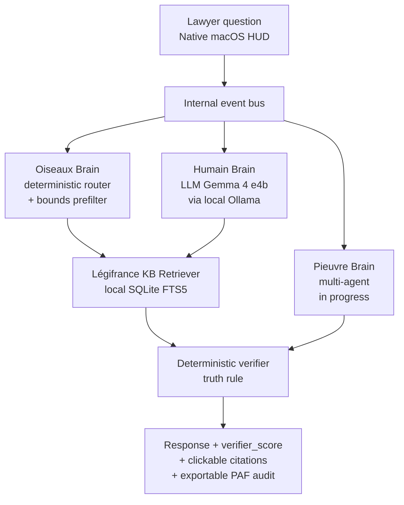

# Beaume Architecture

*[Lire en français](architecture.fr.md)*

Public document. High-level. No sensitive internals (tuned prompts,
empirical thresholds, root causes — see
[`docs/sprints/SUMMARY.md`](sprints/SUMMARY.md) for the doctrine).

---

## Overview

Beaume answers a lawyer's question via three complementary brains
plus a deterministic verifier downstream.



Clickable components:

- **Native macOS HUD** → [`app/ui/hud_native.py`](../app/ui/hud_native.py)
- **Event bus** → [`lucie_v1_standalone/pipeline.py`](../lucie_v1_standalone/pipeline.py)
- **Oiseaux Brain (router)** → [`lucie_v1_standalone/dialogue/intent_classifier.py`](../lucie_v1_standalone/dialogue/intent_classifier.py)
- **Humain Brain (local LLM)** → [`lucie_v1_standalone/ollama_client.py`](../lucie_v1_standalone/ollama_client.py)
- **Légifrance KB Retriever** → [`lucie_v1_standalone/retriever.py`](../lucie_v1_standalone/retriever.py) + [`lucie_v1_standalone/knowledge_legifrance/retriever.py`](../lucie_v1_standalone/knowledge_legifrance/retriever.py)
- **Verifier** → [`lucie_v1_standalone/verificateur.py`](../lucie_v1_standalone/verificateur.py)
- **Adaptive memory** → [`lucie_v1_standalone/memory/`](../lucie_v1_standalone/memory/)

---

## The three brains

### Oiseaux Brain — fast deterministic

Intent router plus numeric prefilter. Target latency: < 50 ms, zero
LLM call. Rejects out-of-scope questions, invalid article references
(numeric bounds), and `lic_eco` vs `lic_perso` ambiguities upstream.

Why deterministic first: this is the architectural guarantee that
the truth rule (principle 2 of [`PRINCIPLES.md`](../PRINCIPLES.md))
is applied *before* an LLM has any chance to hallucinate.

### Humain Brain — local LLM

Phrases the answer in natural language from material that has
already been validated (Légifrance chunks returned by the retriever).

Model: Gemma 4 e4b via Ollama, `keep_alive=24h` to avoid reloads
between calls. The model is interchangeable (Llama, Mistral, Qwen)
at the cost of recalibrating the verifier thresholds — not
architecturally breaking.

### Pieuvre Brain — multi-agent (in progress)

Orchestrates composite queries that require combining several
sources (case law + Code + client file). Sprint 9–10 delivery
(summer 2026).

As long as Pieuvre is not delivered, the pipeline runs on two
operational brains (Oiseaux + Humain). Honesty: we do not claim
"3 functional brains" before they actually are.

---

## Deterministic verifier downstream

Three points where the truth rule is applied:

1. **Deterministic refusal before LLM** — if the question is
   out-of-scope or if the article reference cited in the question is
   invalid, immediate refusal (Oiseaux Brain).
2. **Post-generation citation verification** — every citation
   produced by the Humain Brain is canonicalized and matched
   against the local Légifrance index. Duplicate citations are
   deduplicated (Sprint 6 P2a). The `verifier_score` is computed
   on unique citations, not raw occurrences.
3. **Audit trail exposed to the user** — every answer exposes
   `verifier_score` (green/amber/red), the validated citations,
   the tooltip with detailed verdict. "Export PAF audit" button
   in the menubar.

Rationale for the `verifier_score ≥ 0.70` threshold: see
[`bench/CHANGELOG.md`](../bench/CHANGELOG.md).

---

## Légifrance knowledge base

Local SQLite index with FTS5, generated from public DILA archives
(`legifrance` from the official site).

- Typical size: ~4.6 GB compacted
- **Not included in the public repo**: too large, explicitly ignored
  by [`.gitignore`](../.gitignore) (`knowledge/legifrance/data/`,
  `tarballs/`).
- Generation: see
  [`lucie_v1_standalone/knowledge_legifrance/`](../lucie_v1_standalone/knowledge_legifrance/)
  (DILA parser + indexer)

Practical consequence: a user who clones the public repo must
generate their own index locally before Beaume is operational.
This is intentional — the Légifrance KB is not a secret, but it is
publicly derivable by anyone.

---

## Adaptive memory

Local per-user storage in
`~/Library/Application Support/Beaume/`. The "What Beaume knows
about you" page in the HUD exposes the entire memory and allows
a full reset in one click.

Components:

- [`lucie_v1_standalone/memory/personal.py`](../lucie_v1_standalone/memory/personal.py) — explicit preferences
- [`lucie_v1_standalone/memory/abstract.py`](../lucie_v1_standalone/memory/abstract.py) — usage patterns
- [`lucie_v1_standalone/memory/store.py`](../lucie_v1_standalone/memory/store.py) — local JSON persistence
- [`lucie_v1_standalone/memory/sanitizer.py`](../lucie_v1_standalone/memory/sanitizer.py) — PII detection before writing

Consequence of principle 5 ([`PRINCIPLES.md`](../PRINCIPLES.md)):
two Beaume instances on two different Macs diverge after a few
weeks of usage. No shared cloud memory.

---

## Formal Architecture Specification

> *This specification describes Beaume's **target architecture as
> of May 2026**. Some components — notably the inference engine's
> `backward` chaining and `solve` constraint solver — are partially
> implemented in v1 and will be completed in Sprint 8 (Deterministic
> Brain). See [`docs/sprints/SUMMARY.md`](sprints/SUMMARY.md) for
> current progress.*

### Scientific definition

> Beaume is a **deterministic legal expert system** with a structured
> inference pipeline, using an LLM solely as a linguistic surface
> layer with no involvement in the decision-making process.

### Pipeline — 7 stages

```
USER INPUT
    ↓
ORCHESTRATOR (Pieuvre)         — flow control + memory + planning
    ↓
INFERENCE ENGINE (Oiseaux)     — legal rules + chaining + constraints
    ↓
DATA ENGINE                    — statutes + case law + local base
    ↓
DETERMINISTIC VALIDATION       — article existence + rule coherence
    ↓
LLM (Humain Brain)             — drafting only, no decision-making
    ↓
USER RESPONSE
```

### Module decomposition (signature-only)

**Orchestrator (Pieuvre)** — flow control, no legal logic:

```python
class Orchestrator:
    def process(self, query: str) -> dict:
        state = self.load_memory(query)
        plan = self.plan(query, state)
        result = self.execute_plan(plan)
        self.save_memory(query, result)
        return result
```

**Inference engine (Oiseaux)** — three operations:

- `forward(facts)` — forward chaining: facts → activated rules → new facts → loop
- `backward(goal)` — backward chaining: goal → rules → subgoals → facts
- `solve(constraints)` — constraint solving: legal constraints → coherent set

**Knowledge layer** — minimal v1 format:

```json
{
  "L.1234-9": {
    "conditions": ["seniority >= 8 months"],
    "result": "mandatory indemnity"
  }
}
```

**Retrieval module** — `find_article(query) -> article | None`.

**Deterministic validation** — `validate(article) -> bool`: the
article exists, the rule set is coherent, otherwise STOP or
fallback.

**LLM (Humain Brain)** — UNIQUE role: transform structure → lawyer
language. Zero decisions, zero invented references.

### Per-query memory model

```json
{
  "query": "...",
  "facts": [],
  "applied_rules": [],
  "decisions": [],
  "questions_missing": []
}
```

### Formal properties

1. **Global determinism** — `output(X) = constant` (conditional, see
   refinement 1).
2. **Strict role separation** — orchestrator = flow, inference engine
   = logic, KB = truth, LLM = language.
3. **Full traceability** — question → rules → facts → decision → text.
4. **No legal hallucination** — the LLM cannot introduce new articles.
5. **No cloud dependency** — 100% local.

### What Beaume IS

> A **deterministic legal expert system augmented with a linguistic
> generation module**.

### What Beaume IS NOT

- Not an autonomous LLM agent
- Not a probabilistic system
- Not a generative decision model
- Not a stochastic reasoning system

### Refinements (validated 2026-05-12)

1. **Global determinism is conditional on LLM configuration.**
   `output(X) = constant` only holds if `temperature=0` AND a fixed
   `seed` AND a strictly identical prompt. Otherwise two LLM runs
   may produce two phrasings (same facts, variable syntax). Pinned
   explicitly in the Ollama config.
2. **The LLM can still hallucinate phrasing** — not legal content
   (locked), but tone nuances, reformulations, invented hedging
   ("it should be noted that..."). `validate(article)` covers legal
   references but not free text. Mitigation: an additional
   `linguistic_validator` layer checks that LLM output contains no
   L./R./Cass. citation absent from the authorized fact set.
3. **The `{conditions, result}` KB structure is simplified.** Real
   legal reasoning has four dimensions not captured here: source
   hierarchy (Constitution > Convention > Statute > Decree >
   collective agreement), exceptions, interpretive case law,
   temporal articulation (historical versions of an article).
   Acceptable for v1 (economic dismissal), to be enriched before
   the Sprint 8 full Deterministic Brain.
4. **Two-level memory** — the schema above shows per-query memory.
   The architecture also includes **long-term memory** (archived
   lawyer corrections, added rules, user preferences) that feeds
   the knowledge base over time. This is the permanent cognitive
   loop of the system.
5. **Naming consistency** — the deterministic brain is spelled
   "Cerveau" (French for *brain*) throughout. A historical misspelling
   in early presentations has been corrected in all current public
   documents.

---

## Not in this document

Sensitive **implementation details** remain in reserve:

- The fine tuning of the system prompts (8
  `lucie_v1_standalone/prompts/*.txt` files are versioned, but
  future evolution will move through `prompts_private/`, see
  [`docs/THREAT_MODEL.md`](THREAT_MODEL.md)).
- Empirical thresholds calibrated through repeated battery runs.
- Rejected implementation choices.
- Modules in competitive stash (voice, video, OCR, multi-modal,
  calendar/CRM, dictation, emotion analysis).

NDA access possible for partner lawyers and serious collaborators:
mathieu.ballotma@gmail.com.
