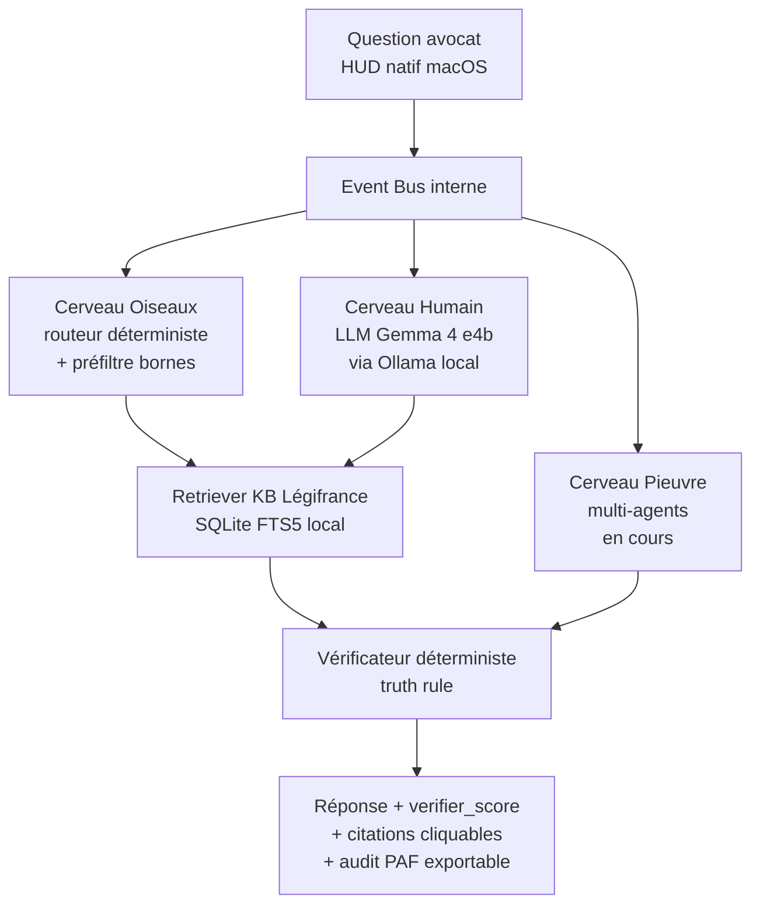

# Architecture Beaume

Document public. High-level. Pas de détails internes sensibles
(prompts tunés, seuils empiriques, causes racines de bugs — voir
[`docs/sprints/SUMMARY.md`](sprints/SUMMARY.md) pour la doctrine).

---

## Vue d'ensemble

Beaume répond à une question d'avocat en passant par trois cerveaux
complémentaires + un vérificateur déterministe en aval.

Composants cliquables :

- **HUD natif macOS** → [`app/ui/hud_native.py`](../app/ui/hud_native.py)
- **Event Bus** → [`lucie_v1_standalone/pipeline.py`](../lucie_v1_standalone/pipeline.py)
- **Cerveau Oiseaux (routeur)** → [`lucie_v1_standalone/dialogue/intent_classifier.py`](../lucie_v1_standalone/dialogue/intent_classifier.py)
- **Cerveau Humain (LLM local)** → [`lucie_v1_standalone/ollama_client.py`](../lucie_v1_standalone/ollama_client.py)
- **Retriever KB Légifrance** → [`lucie_v1_standalone/retriever.py`](../lucie_v1_standalone/retriever.py) + [`lucie_v1_standalone/knowledge_legifrance/retriever.py`](../lucie_v1_standalone/knowledge_legifrance/retriever.py)
- **Vérificateur** → [`lucie_v1_standalone/verificateur.py`](../lucie_v1_standalone/verificateur.py)
- **Mémoire adaptative** → [`lucie_v1_standalone/memory/`](../lucie_v1_standalone/memory/)

---

## Les trois cerveaux

### Cerveau Oiseaux — déterministe rapide

Routeur d'intention + préfiltre numérique. Latence cible : < 50 ms,
zéro appel LLM. Rejette en amont les questions hors périmètre, les
références d'article invalides (bornes numériques) et les
ambiguïtés `lic_eco` vs `lic_perso`.

Pourquoi déterministe d'abord : c'est la garantie architecturale
que la truth rule (principe 2 de [`PRINCIPLES.md`](../PRINCIPLES.md))
est appliquée *avant* qu'un LLM n'ait eu l'occasion d'halluciner.

### Cerveau Humain — LLM local

Formule la réponse en langage naturel à partir de matériel déjà
validé (chunks Légifrance retournés par le retriever).

Modèle : Gemma 4 e4b via Ollama, `keep_alive=24h` pour éviter le
reload entre appels. Le modèle est interchangeable (Llama, Mistral,
Qwen) au prix d'une recalibration des seuils Vérificateur — pas
breaking architecturalement.

### Cerveau Pieuvre — multi-agents (en cours)

Orchestre les requêtes composites qui nécessitent de combiner
plusieurs sources (jurisprudence + Code + dossier client). Livraison
Sprint 9-10 (été 2026).

Tant que Pieuvre n'est pas livré, le pipeline reste sur 2 cerveaux
opérationnels (Oiseaux + Humain). Honnêteté : on ne dit pas « 3
cerveaux fonctionnels » avant qu'ils ne le soient.

---

## Vérificateur déterministe en aval

Trois points d'application de la truth rule :

1. **Refus déterministe avant LLM** — si la question est hors
   périmètre ou si la référence d'article cité dans la question est
   invalide, refus immédiat (Cerveau Oiseaux).
2. **Vérification des citations post-génération** — chaque citation
   produite par le Cerveau Humain est canonicalisée et matchée
   contre l'index Légifrance local. Les citations dupliquées sont
   dédoublonnées (Sprint 6 P2a). Le score `verifier_score` est
   calculé sur les citations uniques, pas sur les occurrences
   brutes.
3. **Audit trail exposé à l'utilisateur** — chaque réponse expose
   `verifier_score` (vert/ambre/rouge), les citations validées, le
   tooltip avec verdict détaillé. Bouton « Exporter audit PAF »
   dans le menubar.

Justification du seuil `verifier_score ≥ 0.70` : voir
[`bench/CHANGELOG.md`](../bench/CHANGELOG.md).

---

## Knowledge base Légifrance

Index local SQLite avec FTS5, généré à partir des archives DILA
publiques (`legifrance` du site officiel).

- Taille typique : ~4,6 Go compactés
- **Non inclus dans le repo public** : trop volumineux, ignoré
  explicitement par [`.gitignore`](../.gitignore)
  (`knowledge/legifrance/data/`, `tarballs/`).
- Génération : voir [`lucie_v1_standalone/knowledge_legifrance/`](../lucie_v1_standalone/knowledge_legifrance/) (parser DILA + indexer)

Conséquence pratique : un utilisateur qui clone le repo public doit
générer son propre index localement avant que Beaume soit
opérationnelle. C'est intentionnel — la KB Légifrance n'est pas un
secret, mais elle est dérivable publiquement par chacun.

---

## Mémoire adaptative

Stockage local par utilisateur dans
`~/Library/Application Support/Beaume/`. La page « Ce que Beaume
sait de vous » du HUD expose toute la mémoire et permet un reset
complet en un clic.

Composants :

- [`lucie_v1_standalone/memory/personal.py`](../lucie_v1_standalone/memory/personal.py) — préférences explicites
- [`lucie_v1_standalone/memory/abstract.py`](../lucie_v1_standalone/memory/abstract.py) — patterns d'usage
- [`lucie_v1_standalone/memory/store.py`](../lucie_v1_standalone/memory/store.py) — persistance JSON locale
- [`lucie_v1_standalone/memory/sanitizer.py`](../lucie_v1_standalone/memory/sanitizer.py) — détection PII avant écriture

Conséquence du principe 5 ([`PRINCIPLES.md`](../PRINCIPLES.md)) :
deux instances Beaume sur deux Mac différents divergent après quelques
semaines d'usage. Aucune mémoire partagée cloud.

---

## Ce qui n'est pas dans ce document

Les **détails d'implémentation** sensibles restent en réserve :

- Le tuning fin des prompts système (8 fichiers
  `lucie_v1_standalone/prompts/*.txt` sont versionnés mais leur
  évolution future passera par `prompts_private/`, voir
  [`docs/THREAT_MODEL.md`](THREAT_MODEL.md)).
- Les seuils empiriques calibrés par run de batterie répétés.
- Les choix d'implémentation rejetés.
- Les modules en stash compétitif (vocal, vidéo, OCR, multi-modal,
  calendar/CRM, dictée procès, analyse émotion).

Accès sous NDA possible pour investisseurs, mentors et avocats
partenaires : mathieu.ballotma@gmail.com.
